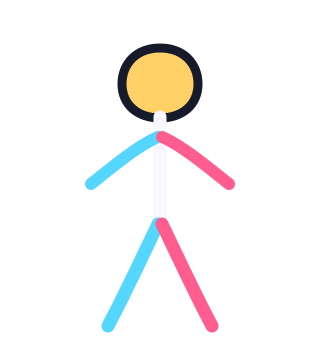

# SVG2D

Language: **English** | [日本語](README.ja.md)

SVG2D is a GDExtension for rendering SVGs, animating their paths, and simulating textured or plain ropes in Godot 2D and 3D scenes. `SVGAnimate2D` / `SVGAnimate3D` expose path anchors, cubic handles, fill and stroke settings to the editor and `AnimationPlayer`. `SpriteRope2D` / `SpriteRope3D` use standard textures; `SVGRope2D` / `SVGRope3D` render SVG sources. Ropes can attach `PhysicsBody2D` / `PhysicsBody3D` nodes through Godot pin joints.

The packaged add-on supports Godot 4.7 or later on Windows x86_64, macOS Universal, iOS arm64, Linux x86_64/arm64, Android arm64, and threadless Web wasm32. See the [English add-on guide](addons/svg2d/README.md) or [Japanese add-on guide](addons/svg2d/README.ja.md) for installation, editor controls, and SVG support.

## Quick start

Copy `addons/svg2d` into your project's `addons` directory and enable **SVG2D** under **Project Settings → Plugins**. Add an `SVG2D` or `SVG3D` node and choose a file with **Open SVG…** beside `src` in the Inspector.

```gdscript
var picture := SVG2D.new()
picture.src = "res://picture.svg"
add_child(picture)
```

For animation, select an `SVGAnimate2D` or `SVGAnimate3D` node, drag its numbered points or cubic handles in the editor, and insert keys with the **Path Editor** or a point's right-click menu. **Create AnimationPlayer (All SVG Properties)** adds initial tracks for all editable points, actual cubic handles, path paint and stroke, and node `modulate`. Solid `fill_color` and `stroke_color` interpolate; `fill_paint` and `stroke_paint` switch non-solid values such as gradients and `none` discretely. Arcs and straight segments retain their SVG command type and do not expose cubic handles. Try the [2D](examples/stickman/stickman_movie.tscn) and [3D](examples/stickman/stickman_movie_3d.tscn) stickman scenes.



## Building from source

Install Godot 4.7, a C++17 compiler, and SCons, then clone the repository with its build-only submodule:

```sh
git clone --recurse-submodules https://github.com/prog-sha/SVG2D.git
cd SVG2D
scons platform=macos target=template_debug
scons platform=macos target=template_release
```

Replace `platform` and `arch` when building for another supported target. Android builds require the Android NDK, and Web builds require Emscripten; use `threads=no` for the packaged Web configuration. Use `template_release` for distribution and `template_debug` for development.

## Testing

On macOS, the test scripts look for Godot 4.7.2 by default. Set `GODOT` when Godot is installed elsewhere.

```sh
sh tests/test.sh
sh tests/test_editor_visual.sh
```

Set `SVG2D_SCALAR=yes` to verify the scalar CPU fallback without SSE2 or NEON.

Run `sh tests/test_simd.sh` on macOS to verify that both paths produce the same pixel SHA-256.

The editor visual test captures the stickman in real 2D and 3D editor views, including nested transforms, flips, multiple handles, color keys, and camera movement. Run `bash tests/build_all.sh` to build all 14 macOS, iOS, Windows, Linux, Android and Web configurations. Per-target content fingerprints skip unchanged builds; use `--force` to invoke every target while retaining SCons's file-level incremental compilation. Run `uv run --no-project python tests/test_binaries.py` to verify every packaged format and architecture.

## Performance and memory settings

| Inspector setting | Nodes | Effect |
| --- | --- | --- |
| `deferred_updates` | SVGAnimate2D / 3D | On by default. Combines path edits until idle time, rebuilding and parsing the SVG once per batch. |
| `keep_render_cache` | SVG2D / 3D and subclasses | Disable to release intermediate buffers after rasterization. Rerendering requires more allocation and computation; the displayed texture is retained. |
| `dynamic_mesh` | SpriteRope3D / SVGRope3D | On by default. Updates vertices and bounds while retaining UVs and triangle indices. |

Point getters and scene saving always use current edits. Call `flush_paths()` before immediately reading an edited 2D texture with deferred updates enabled. 3D texture refresh occurs at idle time. `get_render_cache_bytes()` reports estimated intermediate buffer usage.

`SVGAnimate2D` / `SVGAnimate3D` support the same hand-drawn outline jitter as ordinary SVG nodes. Enable `animation_enabled` in the Inspector, set the amount with `jitter_amount`, and the pattern interval with `animation_interval`. Path animation preserves jitter timing. Editor anchors, handles, picking positions and saved values use the unjittered path coordinates.

`cache_animation_frames` keeps four patterns when enabled, or updates a single texture when disabled. SVGAnimate defaults to disabled for continuous deformation; ordinary SVG2D / SVG3D default to enabled. Enable it for static shapes to avoid rerasterizing each cycle, or disable it to reduce texture memory during frequent path edits. Both modes produce the same jitter.

### Path animation history cache

SVGAnimate's **Animation Cache → Animation Cache Mode** defaults to **Exact Frames**. It reuses textures when an identical serialized path state, resolution and jitter configuration recur. Hits skip SVG parsing, rasterization and texture upload. There is no time or coordinate quantization: continuously varying interpolation values may not hit. Use **Disabled** when retaining past frames is not useful.

**Animation Cache Limit Mb** sets the history budget (32 MiB by default, 1–256). Up to 512 frames are retained, evicting least recently used entries when either limit is reached. Oversized individual frames bypass retention. Current display references and renderer work buffers are separate from this budget. Replacing `src`, changing the mode or calling `clear_animation_cache()` clears history.

Use `get_animation_cache_hits()`, `get_animation_cache_misses()`, `get_animation_cache_bytes()` and `get_animation_cache_frame_count()` to inspect usage. `cache_animation_frames` retains jitter patterns for the current shape; **Exact Frames** also retains previous path states. Neither changes editor anchor or handle coordinates.

### Cutting ropes and two-way physics

`cut_segment(from, to)` cuts at the first intersection along a **global-coordinate** line segment. It inserts an endpoint at the intersection and preserves each piece's lengths, mass, velocities and texture region. `SpriteRope3D` / `SVGRope3D` also accept `tolerance` (default `0.001` world units). Misses, parallel overlaps and rope endpoints return `null`. Apply again to both pieces for multiple crossings.

Run `tests/stickman_rope_swing.tscn`: drag the stickman to pull it through a spring joint; drag the background and release to cut along the displayed line. The stickman keeps its rotation locked.

`cut_at(point_index)` splits at an interior particle, creates the same built-in rope class through `ClassDB.instantiate`, adds it to the same parent and returns it. The original keeps the upper part; the new rope has a free start. Current shape, linear/angular velocities and texture regions are preserved, and length and mass are divided. An attachment at or beyond the cut moves to the new rope. Valid indices are `1` through `segments - 2`. Endpoints, invalid indices and nodes outside the tree return `null` without changes. Runtime only; scripts, children and signal connections are not copied. Use `call_deferred` when cutting from physics query callbacks.

```gdscript
var fallen_rope = $Rope.cut_segment(Vector2(200, 100), Vector2(450, 100))
# fallen_rope.get_parent() == $Rope.get_parent()
```

Unattached ropes use SIMD Verlet integration. Attached ropes use Godot rigid-body physics: `elasticity` and `constraint_iterations` apply to Verlet, while rigid segments use the project's physics solver settings. `damping` is the fraction of velocity removed per 1/60 second, adjusted to the current timestep. Attached bodies keep their own damping settings. Clearing the attachment preserves the moving segments; `reset_simulation()` releases them and restores the initial shape.

The two-way design draws on [Verlet Rope's rigid-body implementation](https://github.com/Tshmofen/verlet-rope-4/blob/master/addons/verlet_rope_4/Physics/VerletRopeRigid.cs), with a C++ implementation here.
